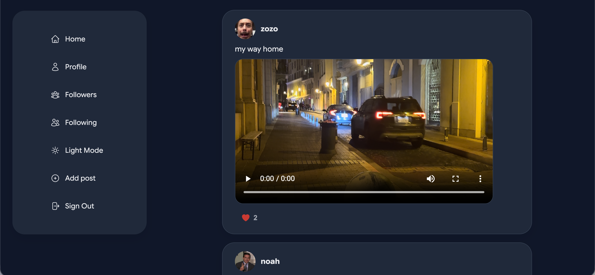

Yapp — Frontend
The React client for the Yapp social media app.

### Getting Started
* Deployed App: https://joyful-flan-714bd6.netlify.app 
* Backend Repo: https://github.com/fatimaAhmed26/yapp-app-backend.git 
* Planning Materials / Trello Board: https://trello.com/b/Q4O9XAwW/social-media-app 

### Description
Yapp lets users sign up, build a profile, and share posts with text, images, or videos. Users can follow other members, like and comment on posts, and manage their own content — all wrapped in a fully responsive UI with light and dark mode support.

## Features
* Authentication — sign up, sign in, and sign out
* Feed — browse all posts with owner info, media, and like counts
* Posts — create, edit, and delete your own posts with optional image/video upload
* Likes — like/unlike posts with a live count
* Comments — add and delete comments on a post, with author attribution
* Follow system — follow/unfollow users, view followers/following lists
* Profiles — view any user's profile and posts; edit your own profile or delete your account
* Authorization guards — edit/delete actions are hidden and blocked for non-owners
* Dark mode — app-wide theme toggle using CSS custom properties

## Technologies Used
* React
* React Router
* Heroicons
* CSS (custom properties for theming/dark mode)
* Vite

## How to use 
- Sign up for an account or sign in.
- Browse the feed to see posts from everyone, or create your own post with text, an image, or a video.
- Like any post to show appreciation, or unlike it to remove your like.
- Leave a comment on any post, and delete your own comments anytime.
- Follow other users to build your network; view their profile to see all their posts.
- Visit your followers & following pages to see your connections.
- Edit your profile (username, bio, profile picture) or delete your account from the edit page.
- Toggle dark mode from the nav for a different look anytime.

## Installation
npm install
npm run dev

## Attributions
* Heroicons for UI icons

